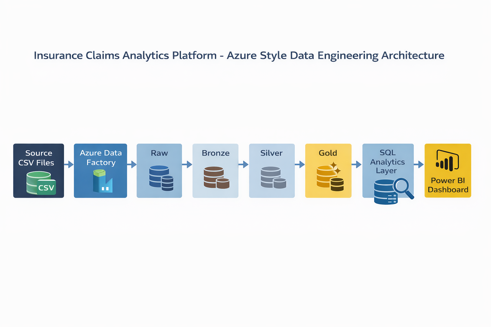
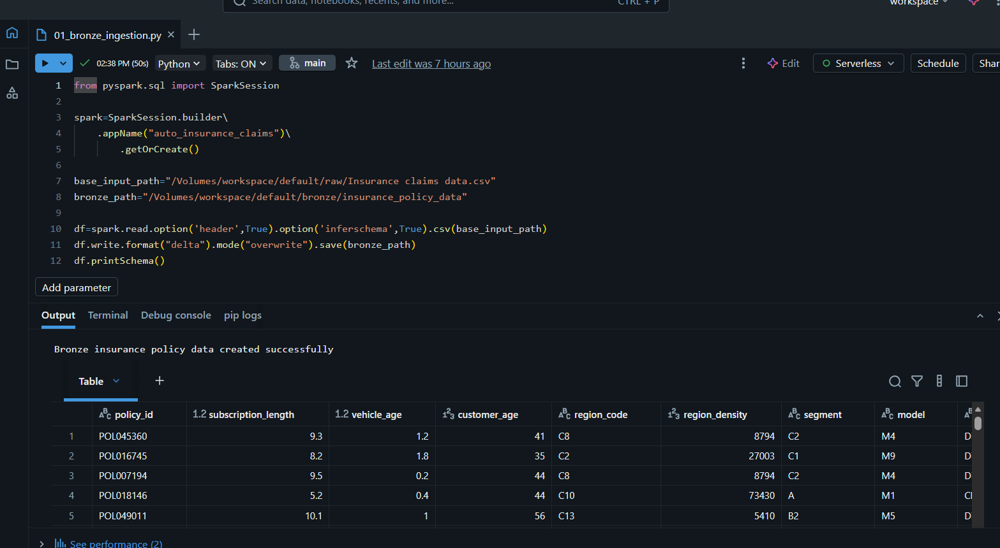
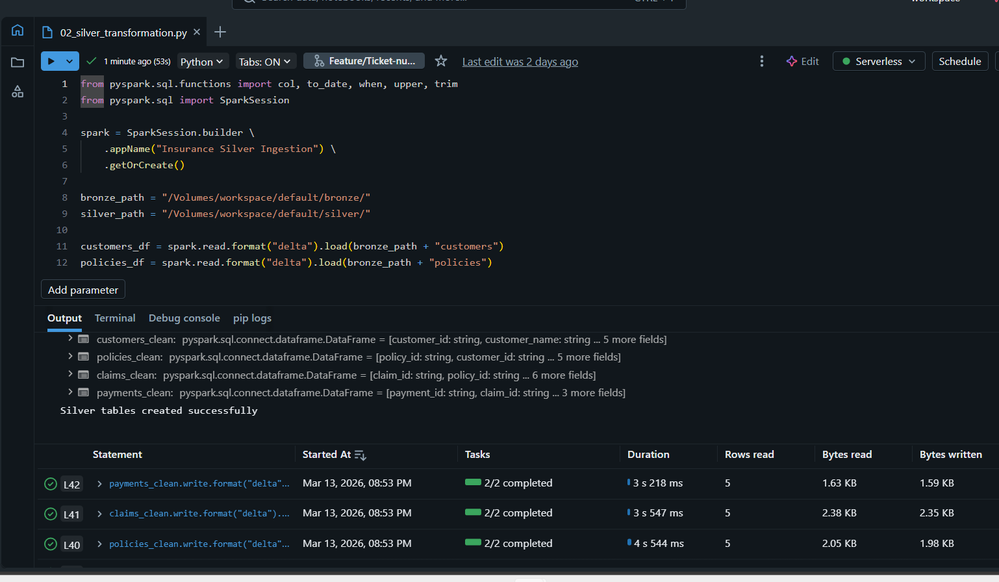
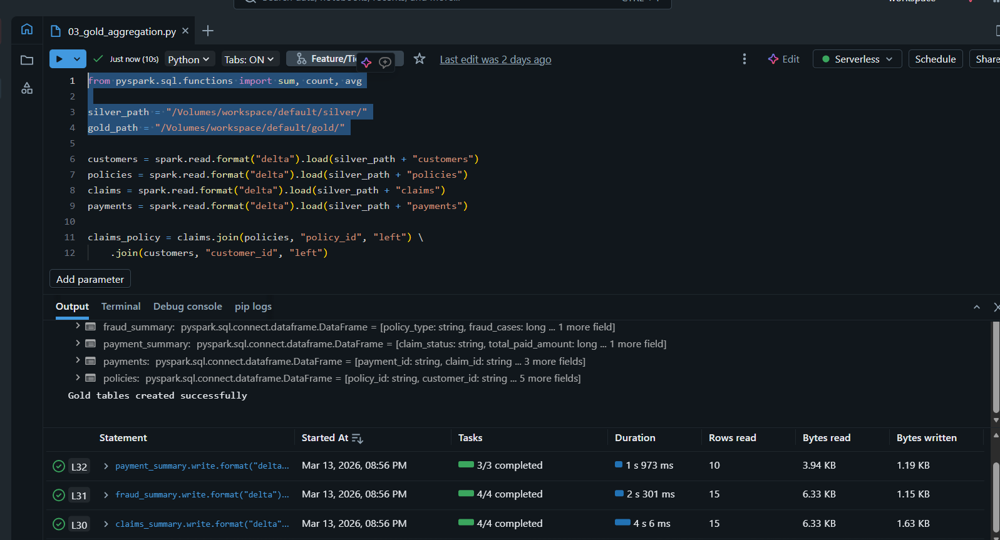
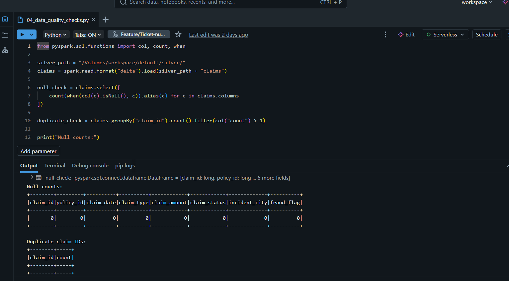
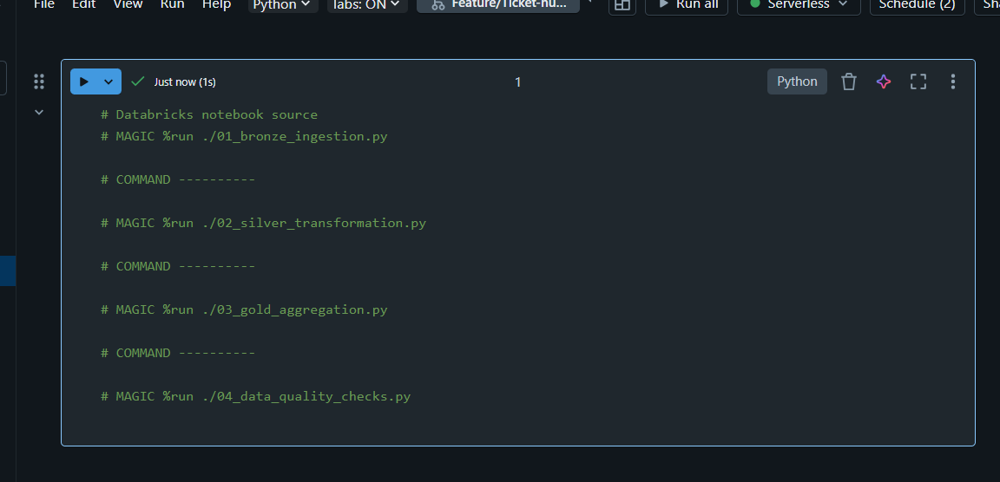
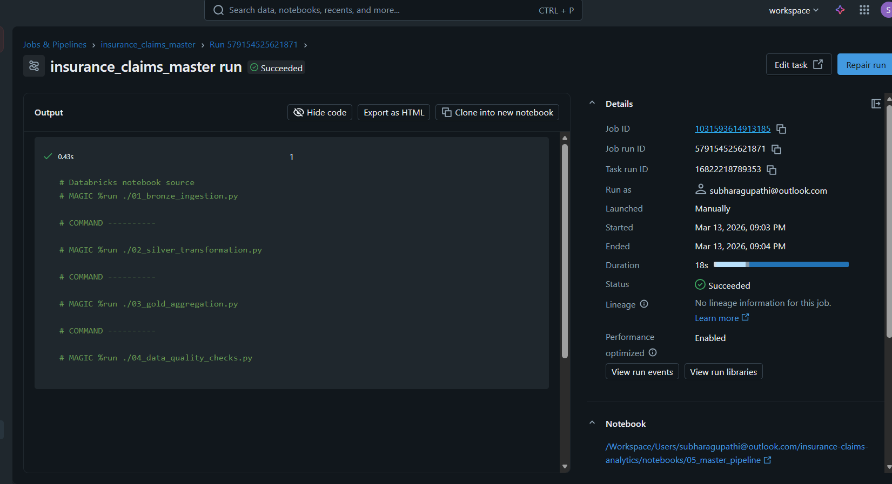
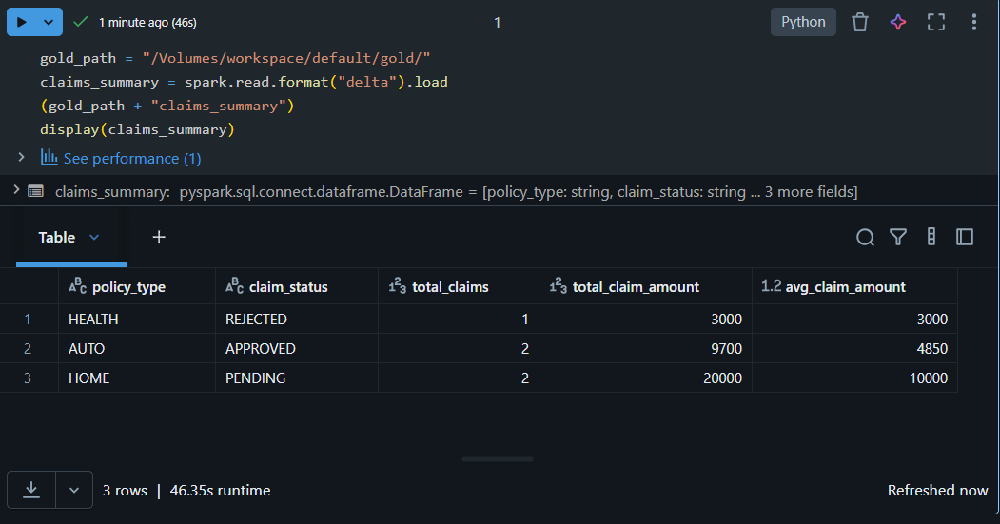

# Insurance Claims Analytics Platform

## Overview
This project implements an end-to-end insurance claims analytics pipeline using an Azure-style medallion architecture. It processes raw customer, policy, claims, and payment data through bronze, silver, and gold layers to produce analytics-ready outputs for downstream reporting.

## Business Problem
Insurance organizations generate customer, policy, claims, and payment data from multiple upstream systems. Raw source data is not directly suitable for analytics because it often contains duplicates, inconsistent text values, unstandardized date formats, and limited business-level aggregations.

## Solution
This project builds a layered data engineering pipeline that:

- ingests raw CSV source files
- stores source-aligned records in a bronze layer
- cleans and standardizes data in a silver layer
- creates business-ready summary datasets in a gold layer
- exposes SQL-ready outputs for reporting and analytics
- supports orchestration through a Databricks master pipeline notebook

## Tech Stack
- Python
- PySpark
- Delta Lake
- SQL
- Databricks
- GitHub
- GitHub Actions
- Azure Data Factory (pipeline design)
- Power BI (planned reporting layer)

## End-to-End Flow
Raw CSV Files  
→ Bronze Layer  
→ Silver Layer  
→ Gold Layer  
→ SQL Analytics / Reporting

## Architecture

## Repository Structure
- `data/raw` - source CSV files
- `notebooks` - bronze, silver, gold, and data-quality notebooks
- `sql` - analytical SQL queries
- `docs` - architecture, execution proof, and supporting documentation
- `adf` - Azure Data Factory design notes
- `.github/workflows` - CI workflow for code checks

## Source Data
The project uses the following raw input datasets:

- `customers.csv`
- `policies.csv`
- `claims.csv`
- `payments.csv`

## Processing Layers

### Bronze Layer
Reads raw CSV input files and stores them in Delta format with minimal transformation.

### Silver Layer
Applies cleansing and standardization rules such as:
- duplicate removal
- trimming text columns
- uppercasing categorical fields
- date conversion
- null handling

### Gold Layer
Builds business-ready summary outputs for:
- claims summary
- fraud summary
- payment summary

## Data Quality Checks
The project includes validation logic to identify:
- null values
- duplicate claim IDs

## Databricks Execution
The notebooks were executed successfully in Databricks using raw, bronze, silver, and gold Delta paths.

## Pipeline Orchestration
The end-to-end workflow is orchestrated through a Databricks master pipeline notebook that executes:
1. bronze ingestion
2. silver transformation
3. gold aggregation
4. data-quality checks

## Gold Layer Output Preview

## Sample Business Outputs
- total claims by policy type
- fraud rate by policy type
- payment summary by claim status
- claim amount trends

## Future Enhancements
- add Power BI dashboard screenshots
- implement ADF orchestration in Azure
- replace sample data with larger public datasets
- extend monitoring and parameterization

## Status
Core pipeline implementation completed with Databricks execution, gold outputs, and notebook orchestration.
