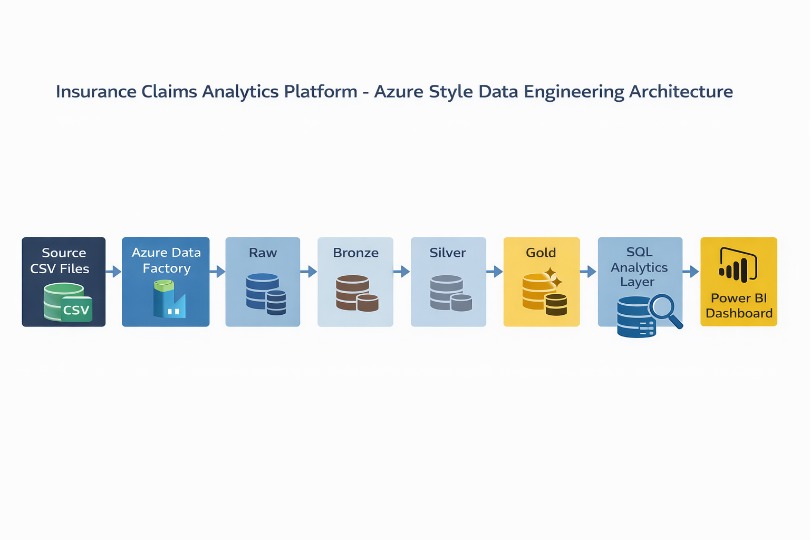
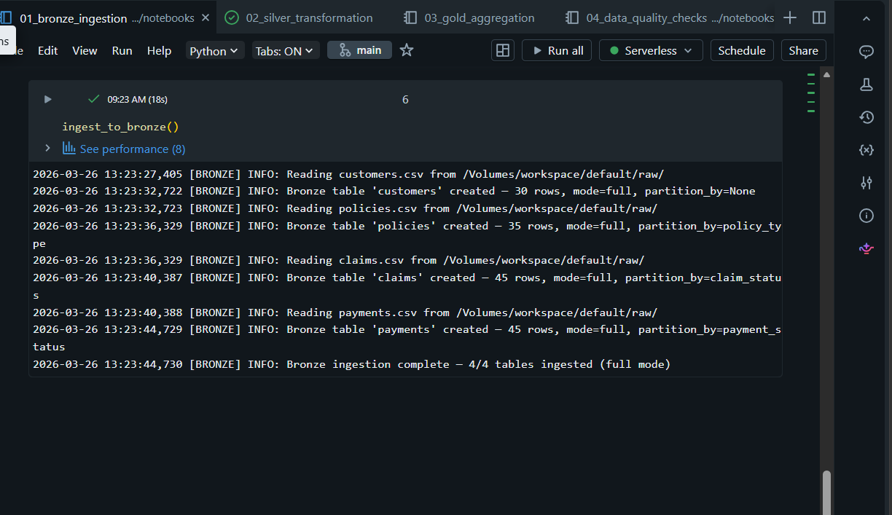
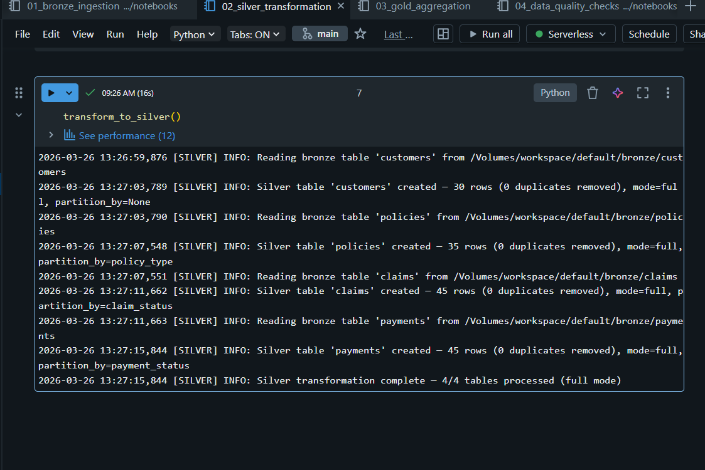
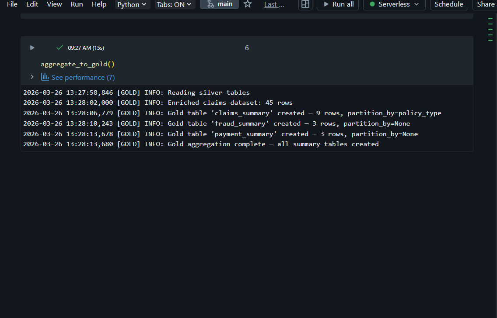
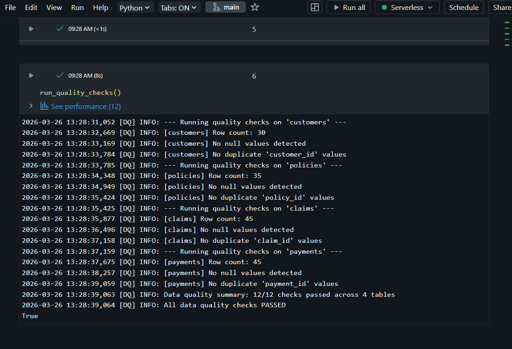
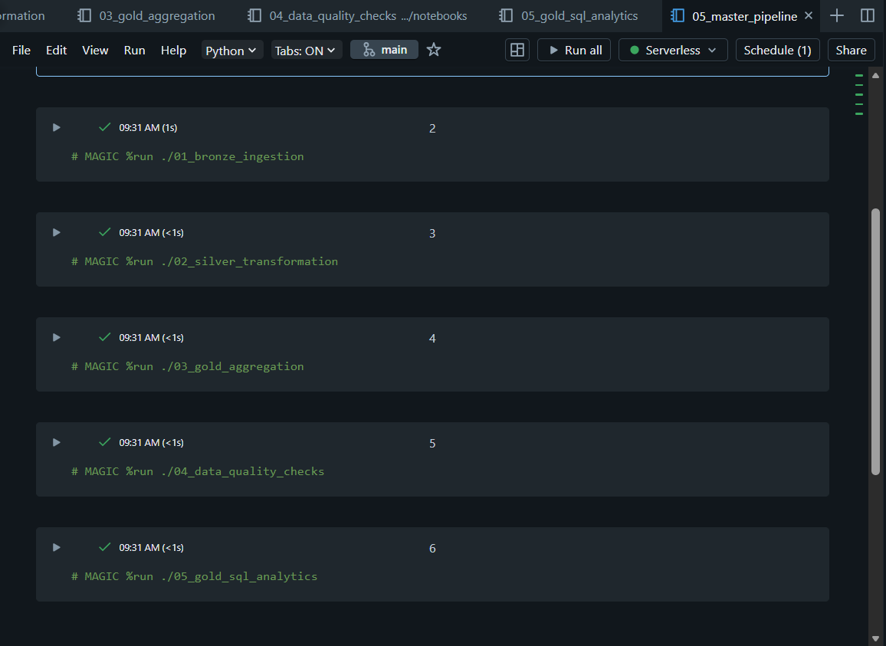
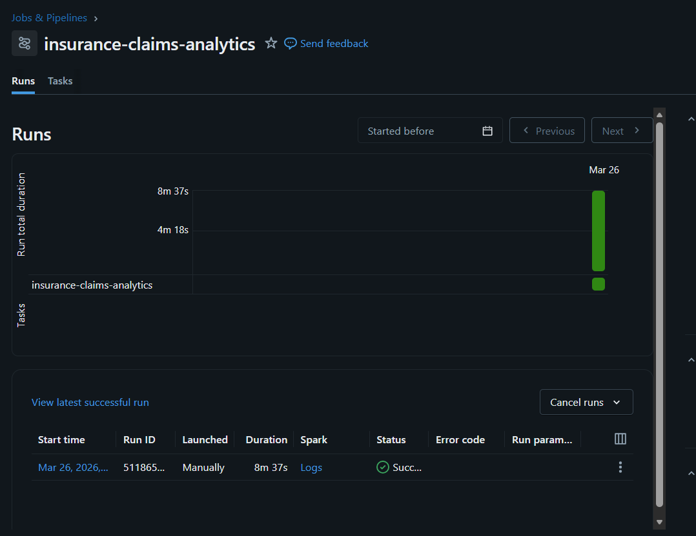
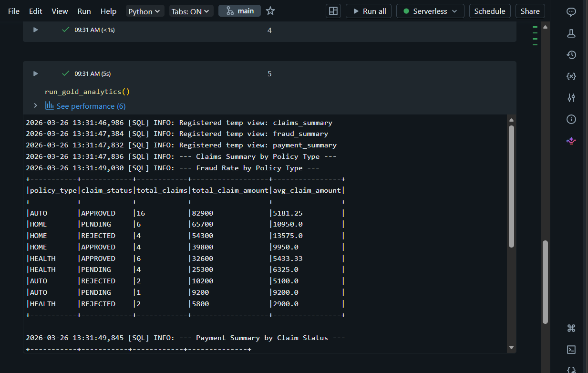

# Insurance Claims Analytics Platform

## Overview
An end-to-end insurance claims analytics pipeline built on Databricks using the **medallion architecture** (Bronze → Silver → Gold). It processes raw customer, policy, claims, and payment data through layered transformations to produce analytics-ready outputs for fraud monitoring, claims tracking, and payment analysis.

## Business Problem
Insurance organizations generate operational data from multiple upstream systems. Raw source data contains duplicates, inconsistent text values, unstandardized date formats, and no business-level aggregations — making it unsuitable for direct reporting.

## Solution
This pipeline:
- Ingests raw CSV source files with **schema validation**
- Stores source-aligned records in a **bronze** layer with Delta partitioning
- Cleans and standardizes data in a **silver** layer (dedup, null handling, date parsing)
- Creates business-ready summary datasets in a **gold** layer partitioned for query performance
- Supports both **full-refresh** and **incremental merge/upsert** load modes
- Runs **data quality checks** across all tables (nulls, duplicates, row counts)
- Executes **SQL analytics** for downstream reporting
- Includes **31 unit tests** covering transformations, aggregations, merge logic, and partitioning
- Uses **centralized configuration** for environment portability
- **Compatible with Databricks Community Edition (free)**

## Tech Stack
| Layer | Technology |
|-------|-----------|
| Processing | Python, PySpark 3.5.1 |
| Storage | Delta Lake (partitioned) |
| Incremental Loads | Delta MERGE (upsert) |
| Analytics | SQL, Pandas |
| Platform | Databricks (Community Edition compatible) |
| Orchestration | Databricks Notebooks, Azure Data Factory (design) |
| CI/CD | GitHub Actions (syntax validation + pytest) |
| Testing | pytest (31 tests) |
| Reporting | Power BI (planned) |

## Architecture


## End-to-End Flow
```
Raw CSV Files → Bronze (Ingestion + Schema Validation + Partitioning)
             → Silver (Cleaning + Standardization + Merge/Upsert)
             → Gold (Business Aggregations + Partitioned Outputs)
             → Data Quality Checks (All Tables)
             → SQL Analytics / Reporting
```

## Repository Structure
```
insurance-claims-analytics/
├── config/
│   ├── __init__.py
│   └── pipeline_config.py          # Paths, schemas, partitions, merge keys, load mode
├── notebooks/
│   ├── 00_pipeline_config.py        # Shared config notebook (loaded via %run)
│   ├── 01_bronze_ingestion.py       # Raw CSV → Delta with schema validation + merge
│   ├── 02_silver_transformation.py  # Cleaning, dedup, standardization + merge
│   ├── 03_gold_aggregation.py       # Partitioned business-ready summary tables
│   ├── 04_data_quality_checks.py    # Null, duplicate, and row-count validation
│   ├── 05_gold_sql_analytics.py     # SQL queries against gold tables
│   └── 05_master_pipeline.py        # End-to-end orchestration notebook
├── tests/
│   └── test_transformations.py      # 31 pytest tests (7 test classes)
├── sql/
│   └── gold_metrics.sql             # Reference SQL queries
├── data/raw/                        # Source CSV files (30 customers, 35 policies, 45 claims, 45 payments)
├── docs/                            # Architecture diagrams and execution proofs
├── adf/                             # Azure Data Factory pipeline design
├── .github/workflows/               # CI/CD pipeline
└── requirements.txt
```

## Processing Layers

### Bronze Layer (`01_bronze_ingestion.py`)
- Reads raw CSV files from the configured volume path
- **Validates column schema** against expected definitions before writing
- Supports **full overwrite** or **incremental merge/upsert** via Delta MERGE
- Partitions tables by configured columns (e.g., policies by `policy_type`)
- Logs row counts, load mode, and any schema mismatches

### Silver Layer (`02_silver_transformation.py`)
- Removes duplicates on primary keys (customer_id, policy_id, claim_id, payment_id)
- Trims whitespace and uppercases categorical text fields
- Converts string dates to proper DateType
- Defaults null `fraud_flag` values to 0
- Supports **incremental merge** — only new/changed records are upserted
- Preserves partitioning from bronze layer

### Gold Layer (`03_gold_aggregation.py`)
- **Claims Summary**: total claims, total/average amounts by policy type and status — partitioned by `policy_type`
- **Fraud Summary**: fraud case counts and fraud rate percentage by policy type
- **Payment Summary**: total paid amounts and counts by claim status
- Gold tables are always fully recomputed from silver (aggregations don't support incremental merge)

### Data Quality (`04_data_quality_checks.py`)
Validates **all four silver tables** with:
- Null value detection per column
- Duplicate primary key checks
- Minimum row count thresholds
- Summary report of passed/failed checks

### SQL Analytics (`05_gold_sql_analytics.py`)
Registers gold Delta tables as Spark SQL temp views and runs:
- Claims breakdown by policy type and status
- Fraud rate ranking by policy type
- Payment distribution by claim status

## How to Run on Databricks Community Edition (Free)

### Step 1: Upload CSV Files
1. Go to **Catalog** → **workspace** → **default**
2. Create volumes: `raw`, `bronze`, `silver`, `gold`
3. Upload all 4 CSV files from `data/raw/` into the `raw` volume:
   - `customers.csv`, `policies.csv`, `claims.csv`, `payments.csv`

### Step 2: Import Notebooks
1. Go to **Workspace** → **Users** → your username
2. Right-click → **Import**
3. Import all `.py` files from the `notebooks/` folder
4. Make sure `00_pipeline_config.py` is in the same folder as the other notebooks

### Step 3: Run the Pipeline
**Option A — Run individually (recommended for first time):**
1. Open and run `01_bronze_ingestion` → verify bronze tables created
2. Open and run `02_silver_transformation` → verify silver tables created
3. Open and run `03_gold_aggregation` → verify gold tables created
4. Open and run `04_data_quality_checks` → verify all checks pass
5. Open and run `05_gold_sql_analytics` → view business metrics

**Option B — Run all at once:**
- Open and run `05_master_pipeline` notebook

### Step 4: Switch to Incremental Mode (Optional)
After the first full load, test incremental merge:
1. In `00_pipeline_config`, change `LOAD_MODE` to `"incremental"`
2. Re-run the pipeline — it will MERGE instead of overwrite

## Incremental Load Support
The pipeline supports two load modes:

| Mode | Behavior | When to Use |
|------|----------|-------------|
| `full` (default) | Overwrites entire tables | Initial load, full refresh |
| `incremental` | Delta MERGE — upsert only new/changed records | Daily batch runs |

In incremental mode:
- Bronze and silver layers use `DeltaTable.merge()` with `whenMatchedUpdateAll()` and `whenNotMatchedInsertAll()`
- Merge keys are defined per table in the config
- First run auto-detects missing tables and falls back to full load
- Gold layer always recomputes from silver (aggregations are idempotent)

## Partitioning Strategy
| Table | Partition Column | Rationale |
|-------|-----------------|-----------|
| policies | `policy_type` | Queries frequently filter by Auto/Home/Health |
| claims | `claim_status` | Dashboards filter by Approved/Pending/Rejected |
| payments | `payment_status` | Payment reports segment by Paid/On Hold/Rejected |
| claims_summary (gold) | `policy_type` | Downstream BI queries group by policy type |
| customers | None | Low cardinality — no benefit from partitioning |

## Configuration
All paths, schemas, partition columns, and merge keys are managed in `notebooks/00_pipeline_config.py`:

```python
# Default: Unity Catalog Volumes (works on free edition)
BASE_PATH = "/Volumes/workspace/default"

# Override via environment variable if needed:
# Set env var: PIPELINE_BASE_PATH="/Volumes/your_catalog/your_schema"

# For incremental mode:
# Set env var: PIPELINE_LOAD_MODE="incremental"
```

## Source Data
| Dataset | Records | Key Columns |
|---------|---------|-------------|
| `customers.csv` | 30 | customer_id, name, age, gender, city, state |
| `policies.csv` | 35 | policy_id, customer_id, type, premium, dates, status |
| `claims.csv` | 45 | claim_id, policy_id, type, amount, status, fraud_flag |
| `payments.csv` | 45 | payment_id, claim_id, amount, status |

## Run Tests Locally
```bash
pip install -r requirements.txt
pytest tests/ -v
```

## Test Suite
**31 tests** across 7 test classes:

| Test Class | Tests | Coverage |
|-----------|-------|----------|
| `TestConfig` | 3 | Config integrity, merge keys, schema definitions |
| `TestSchemaValidation` | 5 | Column structure for all 4 datasets |
| `TestSilverTransformations` | 6 | Dedup, trim/uppercase, null handling, dates |
| `TestGoldAggregations` | 3 | Claims summary, fraud rate, payment summary |
| `TestIncrementalMerge` | 2 | Upsert insert, upsert update |
| `TestPartitioning` | 4 | Partition columns exist, cardinality checks |
| `TestDataQuality` | 8 | Null PKs, duplicates, referential integrity, value ranges |

## CI/CD Pipeline
GitHub Actions runs on every push and PR to `main`:
1. Validates Python syntax on all pipeline scripts and config
2. Runs the full 31-test pytest suite

## Databricks Execution Proof







## Gold Layer Output Preview


## Future Enhancements
- Implement ADF orchestration in Azure for scheduled batch runs
- Add Power BI dashboards connected to gold-layer tables
- Add data lineage tracking and pipeline monitoring alerts
- Implement slowly changing dimensions (SCD Type 2) for customer/policy history
- Add streaming ingestion support for real-time claims processing

## Status
Production-grade pipeline with schema validation, Delta partitioning, incremental merge/upsert, comprehensive data quality checks, 31 unit tests, centralized configuration, CI/CD automation, and Databricks Community Edition compatibility.
